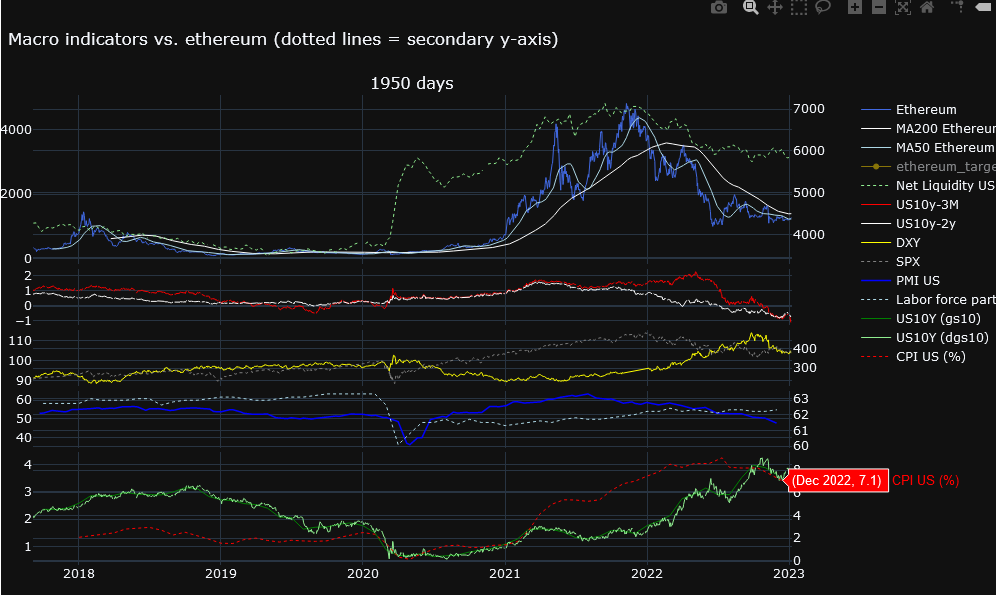
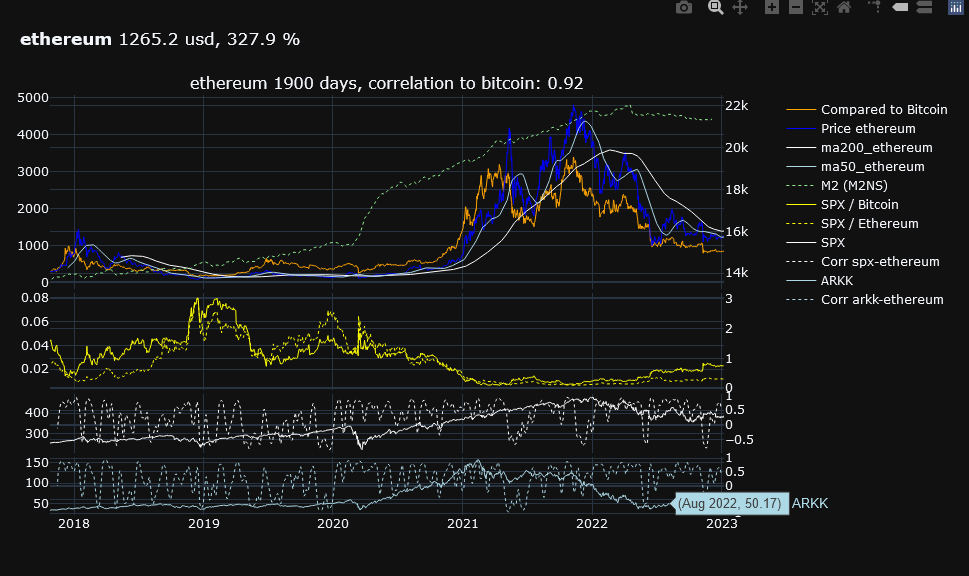
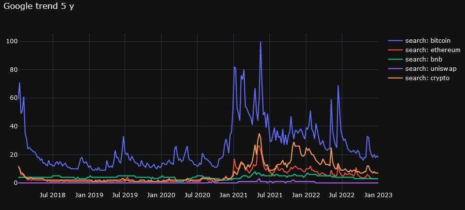
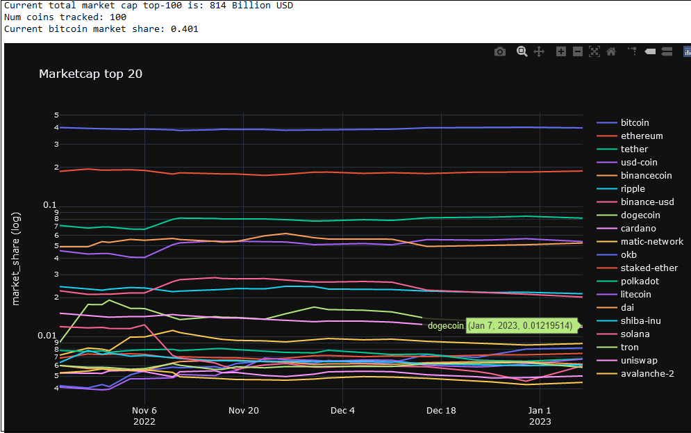
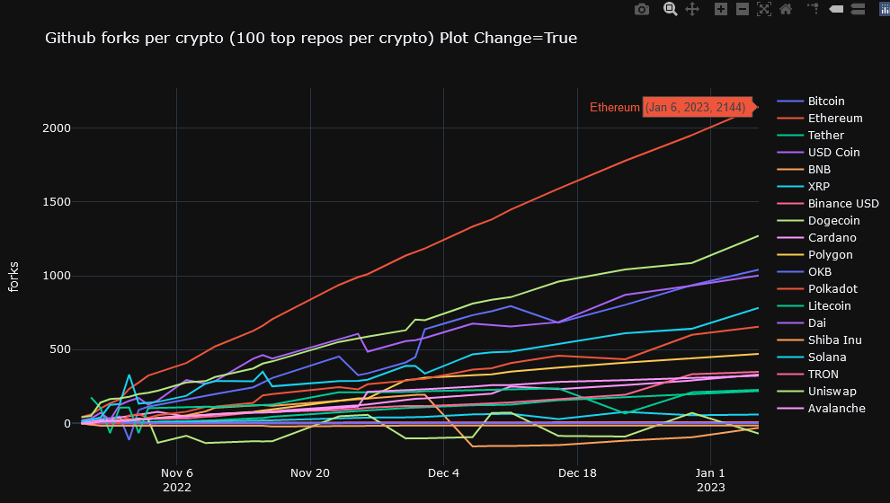
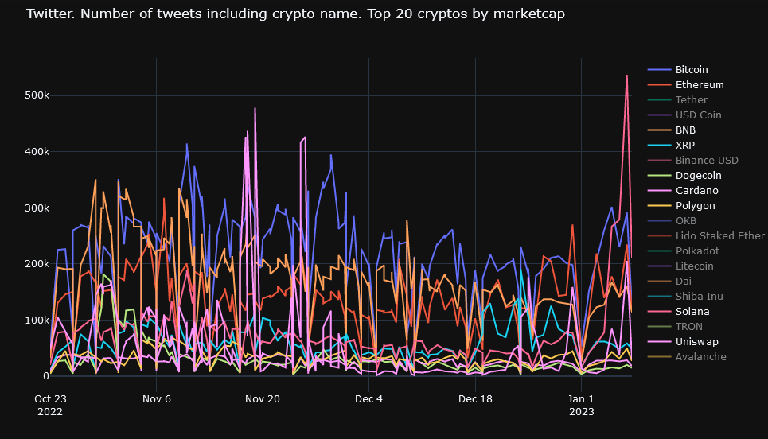
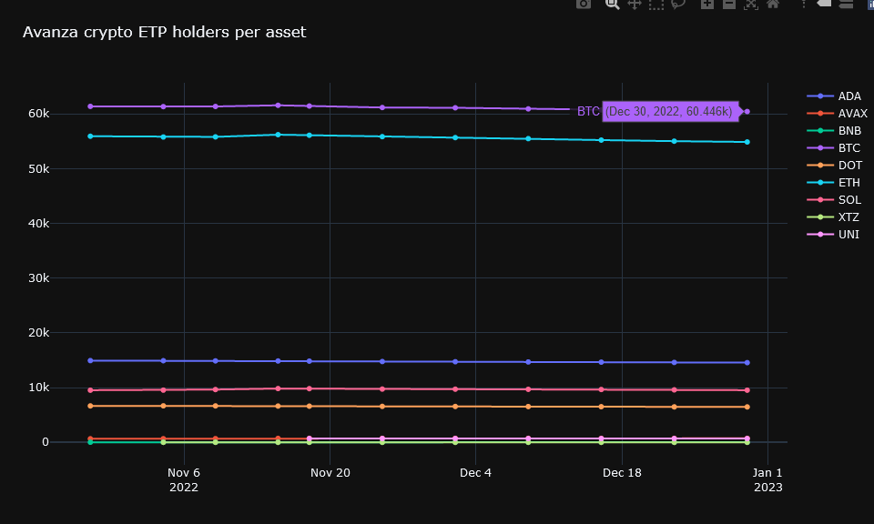

# Crypto Investment analysis vs. Macro economics

Note:
This draft framework is just a part of my learning journey to understand how macro economics affect the crypto market.

I believe a good way to learn macro vs crypto, is to code and connect to APIs yourself. To plot various macro indicators against each other as well as price history.

It could be useful as a complement to fundamental analysis where you dig into use cases, technology, adoption etc. 

And it is fun as well :)

------------------------------------------------------------------

## Graphing and data visualization
I use Plotly that is a great library to get interactive plots where you zoom and get info by hovering over traces.

## APIs and data sources

- Coingecko
    - To get data on Crypto currency's, price history and market cap
    - Note: You need to add your api credentials in config.py
- Pandas data reader
    - To get data from for example FRED  (Federal reserve)
- marketwatch.com
    - To get e.g. DXY data (dollar index)
- yfinance
    - To connect to Yahoo Finance and get stock market data
- Twitter
     - To get number of tweets for various cryptos
     - Note: You need to add your api credentials in config.py
-  Github
     - To get popularity of different cryptos in terms of num repos, stargazes and forks
     - Note: You need to add your api credentials in config.py
-  Google
     - To get search interest and trends for different key words over time
- Other data is updated manually on a monthly basis
     - E.g. US PMI and CPI data, Avanza bank crypto ETPs info etc

## Content and Examples
### 0. Imports and Misc functions
Install modules and set credentials for Github & Twitter (accounts required) in config.py

Please note that y-finance module can be a little tricky since Yahoo Finance make changes to the API once and a while. But it is just to google it. Normally someone else ran into the same problem as you.

    
### 1. Price action and macro indicators
#### Crypto vs Macro and US net liquidity

net liquidity = fed balance sheet - reverse repo - treasury general account
(As per @maxjanderson's thesis)

#### Crypto vs Stock market and U- M2 money supply

    
#### 2. Google trend

#### 3. Crypto Market cap over time

#### 4. Crypto Github stats
Can display number of forks; or number of stargazes; or total number of repos.

Actual numbers or change over time.

#### 5. Crypto Twitter stats

#### 5. Avanza Crypto ETP holders
Avanza is Swedens largest crypto ETP broker.

I plan to track the number of holders over time.
Unfortunatly the unofficial api do contain this info currently so updating needs to be done manually..
